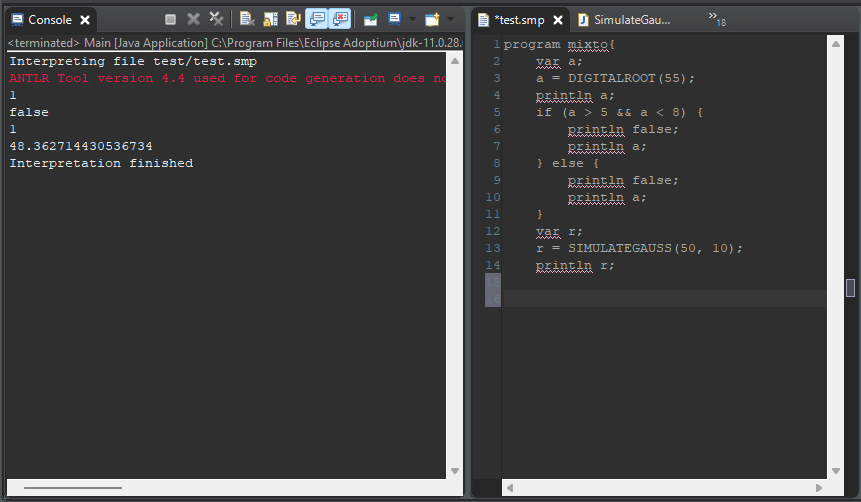
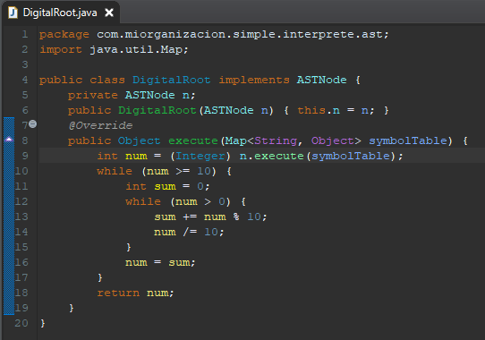
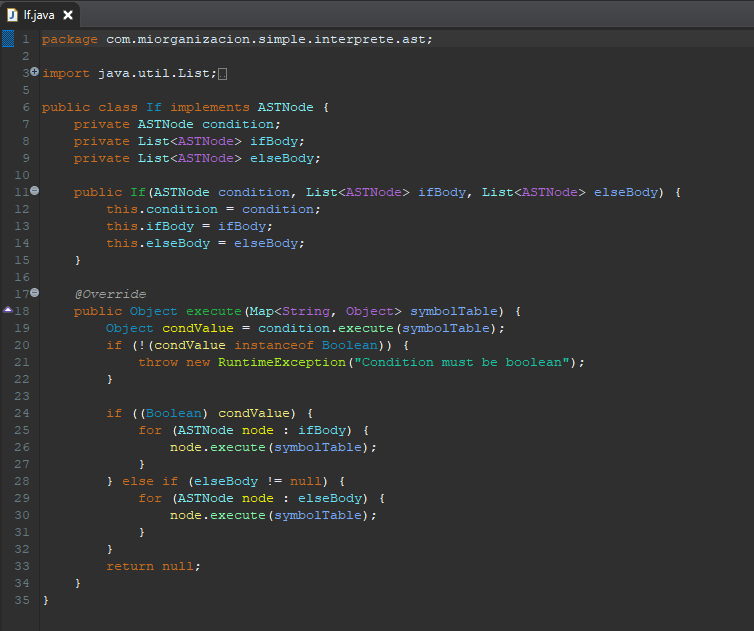
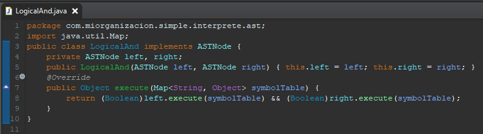
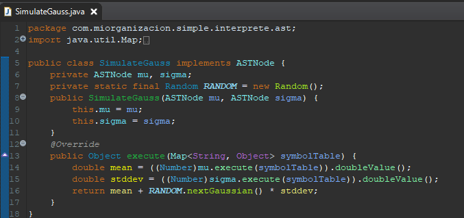

# 🧠 Proyecto: Análisis Semántico y Tabla de Símbolos en Compiladores

Estudiantes:

Castro Moreno Henry Andres - 2022026502

Rivera Mora Jose Ignacio - 2022227827

Curso:
Compiladores e interpretes.

---

## 📌 Introducción
Una vez completadas las etapas de análisis léxico y análisis sintáctico, el intérprete cuenta con una estructura formal del programa fuente: un árbol sintáctico que representa su organización gramatical. Sin embargo, esta representación no garantiza que el programa sea válido desde el punto de vista lógico. Por ejemplo, una variable puede estar correctamente ubicada en la estructura sintáctica, pero no haber sido declarada previamente, lo que constituye un error semántico.

Aquí surge la necesidad del análisis semántico, una fase esencial que permite verificar que las construcciones del programa tengan sentido dentro del contexto del lenguaje. Este paso se apoya en el árbol sintáctico generado previamente y en la tabla de símbolos, una estructura que almacena información sobre los identificadores del programa, como variables, funciones y tipos.

El objetivo principal del análisis semántico es validar restricciones de tipos, declaraciones y ámbitos, asegurando que cada operación, asignación o referencia se realice de forma coherente. Esta etapa permite detectar errores que no pueden ser identificados por el análisis sintáctico, como el uso de variables no declaradas, incompatibilidades de tipo en expresiones, o llamadas a funciones con un número incorrecto de argumentos.

En este documento se profundiza un poco mas en el análisis semántico dentro del intérprete construido, así como la implementación de la tabla de símbolos y su papel en la verificación lógica del programa.

---
##  Implementación del interprete
La imagen a continuacion muestra la ejecucion exitosa del interprete

### Linea por linea
-Se instancia la variable "a"

-Se le asigna a la variable "a", el resultado de la funcion DigitalRoot que en este proyecto cumple como la operación matemática creada por el equipo. A continuacion se presenta la funcion en cuestion.

#### DigitalRoot: Recibe un numero y suma sus digitos hasta que el resultado conste de una sola cifra.

-Se imprime el valor de "a".

-Se ingresa en la estructura condicional. Esta linea comprueba la validacion no solo de la estructura condiconal, sino tambien de las operaciones matemáticas lógicas implementadas.

#### Estructura if-else :

#### Estructura mayor que :

#### Estructura menor que :

#### Estructura compuerta logica AND :

-Tras el bloque de la estructura condicional se tiene la instancia de otra variable "r".

-Se almacena en la variable "r" el resultado de la funcion SIMULATEGAUSS explicada a continuacion.

#### SIMULATEGAUSS: implementación de ASTNode que, al ejecutarse, genera un número aleatorio con distribución normal usando una media (mu) y una desviación estándar (sigma).

-Se imprime el valor de "r".

---

## 📚 Marco Teórico

### 🔍 Análisis Semántico
El análisis semántico es una fase crítica en el proceso de compilación que se encarga de verificar que el programa fuente sea semánticamente coherente con las reglas del lenguaje. A diferencia del análisis sintáctico, que valida la estructura del código, el análisis semántico se enfoca en el significado de las construcciones, asegurando que las operaciones sean válidas y que los tipos de datos sean compatibles.

Según Aho, Lam, Sethi y Ullman (2014), el analizador semántico utiliza el árbol sintáctico y la información contenida en la tabla de símbolos para realizar estas verificaciones. Una de sus funciones principales es el chequeo de tipos (type checking), donde se comprueba que los operadores tengan operandos compatibles. Por ejemplo, si un lenguaje exige que los índices de arreglos sean enteros, el compilador debe reportar un error si se intenta usar un número flotante como índice.

Además, el análisis semántico puede aplicar conversiones de tipo implícitas, conocidas como coerciones. Estas permiten que, por ejemplo, un operador aritmético funcione con un entero y un flotante, convirtiendo automáticamente el entero en flotante para mantener la consistencia. En estos casos, el árbol sintáctico se enriquece con nodos adicionales que representan dichas conversiones, como el operador inttofloat.

Complementando esta visión, el autor destacan que el análisis semántico también recolecta información de tipos y la almacena en el árbol sintáctico o en la tabla de símbolos, preparando el terreno para la generación de código intermedio. Esta etapa actúa como un filtro lógico que previene errores de ejecución y garantiza que el código tenga sentido más allá de su forma.

Por su parte, la tabla de símbolos es una estructura de datos fundamental que almacena información sobre los identificadores del programa: variables, funciones, tipos, constantes, entre otros. Cada entrada en la tabla contiene atributos como el nombre del símbolo, su tipo, su alcance (scope) y, en algunos casos, su valor. Esta tabla es consultada constantemente durante el análisis semántico para validar declaraciones, detectar duplicados y verificar el uso correcto de los elementos del lenguaje.

En conjunto, el análisis semántico y la tabla de símbolos permiten que el compilador actúe como un intérprete lógico del código fuente, asegurando que cada instrucción tenga sentido dentro del contexto del lenguaje y evitando errores que podrían pasar desapercibidos en fases anteriores.

### ⚙️ Funciones del Análisis Semántico
1. ✅ **Verificación de tipos** → asegura compatibilidad de operaciones.  
2. ✅ **Control de declaración y uso de variables** → evita identificadores desconocidos.  
3. ✅ **Manejo de ámbitos** → distingue variables globales y locales.  
4. ✅ **Otras verificaciones** → retorno correcto en funciones, uso de constantes, etc.
5. ✅ **Revisión de parámetros y retorno en funciones** → comprueba que las funciones reciban el número correcto de argumentos y que el tipo de retorno sea el esperado.
6. ✅ **Aplicación de coerciones de tipo** → En algunos lenguajes, se permite convertir automáticamente un tipo en otro compatible. Por ejemplo, convertir un entero en flotante para una operación aritmética mixta. Esto se refleja en el árbol sintáctico con nodos adicionales como inttofloat.

### Ejemplos de errores semanticos
| Tipo de error | Ejemplo   | 
|--------|--------|
| Variable no declarada    | x = 5; sin haber declarado x   | 
| Asignación incompatible de tipos     | int x = "hola"; | 
| Número incorrecto de argumentos     | Llamar a suma(2) cuando la función espera dos parámetros | 
| Índice de arreglo no entero    | array[3.5] en un lenguaje que exige índices enteros |

### 🗂️ Tabla de Símbolos
La tabla de símbolos es una estructura de datos esencial en el diseño de compiladores e intérpretes. Su función principal es registrar los nombres de variables, funciones y otros identificadores utilizados en el programa fuente, junto con sus atributos relevantes. Esta información permite al compilador validar el uso correcto de los elementos del lenguaje durante el análisis semántico y otras fases posteriores.

Como señalan Aho, Lam, Sethi y Ullman (2014), “una función esencial de un compilador es registrar los nombres de variables utilizados en el programa fuente y recopilar información sobre diversos atributos de cada nombre”. Estos atributos incluyen el tipo de dato, el ámbito en el que puede usarse, el almacenamiento asignado, y en el caso de funciones, el número y tipo de argumentos, el método de paso (por valor o por referencia), y el tipo de retorno.

### 📦 Información Típica Almacenada
Cada entrada en la tabla de símbolos representa un identificador y contiene campos que describen sus características. Entre los datos más comunes que se almacenan están:

Nombre del símbolo: El identificador textual (por ejemplo, x, suma, contador)

Tipo de dato: El tipo asociado al símbolo (int, float, string, etc.)

Ámbito (scope): Define si el símbolo pertenece al ámbito global, local o a un bloque específico

Valor (si aplica): En intérpretes, puede incluir el valor actual de una variable o constante

Atributos adicionales: En funciones, se registra el número de parámetros, sus tipos, y el tipo de retorno

### ⚙️ Funciones Principales
La tabla de símbolos cumple varias funciones clave durante el análisis semántico y la ejecución del programa:

Registrar símbolos al declararse Cuando se declara una variable, función o constante, se crea una entrada en la tabla con sus atributos correspondientes.

Consultar símbolos al usarse Cada vez que se utiliza un identificador, el intérprete consulta la tabla para verificar su existencia, tipo y otros atributos necesarios para validar la operación.

Manejo de múltiples ámbitos En lenguajes con estructuras anidadas (como funciones dentro de funciones o bloques condicionales), la tabla debe gestionar correctamente los distintos niveles de visibilidad. Esto se logra mediante estructuras jerárquicas, como pilas de tablas o árboles de ámbitos, que permiten resolver correctamente las referencias según el contexto.

### 🔗 Integración del Análisis Semántico con el Intérprete
Una vez generado el árbol sintáctico abstracto (AST) por el análisis sintáctico, el intérprete utiliza esta estructura como entrada para realizar el análisis semántico. Cada nodo del AST representa una construcción del lenguaje (como una asignación, una operación, o una declaración), y es recorrido por el analizador semántico para validar su significado lógico.

### 🧠 Uso del AST en el Análisis Semántico
El recorrido del AST permite aplicar reglas semánticas específicas a cada tipo de nodo. Por ejemplo:

En una asignación, se verifica que la variable esté declarada y que el tipo del valor sea compatible.

En una operación aritmética, se comprueba que los operandos sean numéricos y que el operador sea válido para esos tipos.

Durante este proceso, el analizador consulta la tabla de símbolos para obtener información sobre los identificadores involucrados.

### ⚠️ Manejo de Errores Semánticos
Cuando se detecta una inconsistencia semántica, el intérprete debe:

Reportar el error con un mensaje claro (por ejemplo, “Variable ‘x’ no declarada”).

Indicar la ubicación del error en el código fuente, si es posible.

Evitar la ejecución de la instrucción afectada para preservar la integridad del programa.

Este manejo de errores es crucial para ofrecer retroalimentación útil al usuario y facilitar la depuración.

### 🧪 Ejemplo de Implementación
Supongamos que el intérprete encuentra la instrucción: x = y + 2;

Durante el análisis semántico:

Se consulta la tabla de símbolos para verificar si y está declarada.

Se comprueba que y y 2 sean del mismo tipo (por ejemplo, ambos int).

Se valida que x esté declarada y que pueda recibir el resultado de la operación.

Si y no está en la tabla de símbolos, se genera un error semántico y se detiene la ejecución de esa línea.

### 🏗️ Implementación de una Tabla de Símbolos
La tabla de símbolos debe ser eficiente y flexible para soportar múltiples ámbitos y operaciones frecuentes durante la interpretación.

### 📦 Información que Almacena
Cada símbolo registrado contiene:

Nombre del identificador

Tipo de dato asociado

Ámbito en el que fue declarado (global, local, etc.)

Valor, si aplica (en el caso de variables o constantes)

Otros atributos, como número de parámetros en funciones o tipo de retorno

### 🧰 Estructuras de Datos Típicas
Para implementar la tabla de símbolos, se utilizan estructuras como:

Diccionarios (hash maps): permiten búsquedas rápidas por nombre.

Pilas de tablas: cada nivel de ámbito (por ejemplo, una función o bloque) tiene su propia tabla, apilada sobre la anterior.

Esto permite manejar correctamente la visibilidad de los símbolos y evitar conflictos entre ámbitos.

### 🔧 Operaciones Básicas
Las operaciones más comunes en la tabla de símbolos incluyen:
#### insertar(nombre, tipo, ámbito): Registra un nuevo símbolo
#### consultar(nombre): Busca un símbolo en el ámbito actual o superior
#### entrarÁmbito(): Crea una nueva tabla y la apila
#### salirÁmbito(): Elimina la tabla del ámbito actual

---

## 📝 Conclusiones
La implementación de un intérprete utilizando ANTLR v4 y Eclipse, guiada por los principios expuestos en la serie de videos del profesor Jaime A. Pavlich-Mariscal, permitió recorrer de forma práctica y estructurada las etapas fundamentales del procesamiento de lenguajes: análisis léxico, sintáctico y semántico.

Tras completar el análisis léxico y sintáctico, se evidenció la necesidad de incorporar un análisis semántico que validara la coherencia lógica del programa. Esta etapa resultó esencial para detectar errores que no pueden ser identificados por la estructura gramatical, como el uso de variables no declaradas, incompatibilidades de tipo o referencias fuera de ámbito.

La integración del análisis semántico con el intérprete se logró mediante el recorrido del árbol sintáctico abstracto (AST) y el uso de una tabla de símbolos eficiente, capaz de registrar, consultar y gestionar identificadores en distintos niveles de ámbito. Esta estructura permitió validar correctamente las operaciones del lenguaje y manejar errores semánticos de forma clara y precisa.

El proyecto no solo consolidó conocimientos técnicos sobre compiladores, sino que también permitió aplicar conceptos teóricos extraídos de fuentes académicas como Compilers: Principles, Techniques and Tools (Aho et al., 2014), fortaleciendo la comprensión del rol que cumple cada fase en la construcción de herramientas de procesamiento de lenguajes.

En conjunto, la experiencia adquirida y la documentación generada constituyen una base sólida para futuros desarrollos, ampliaciones del lenguaje o incluso la evolución hacia compiladores completos con generación de código intermedio y optimización.

---

## 📚 Referencias
- Aho, A., Lam, M., Sethi, R., & Ullman, J. (2006). *Compilers: Principles, Techniques, and Tools*. Pearson.  
- Documentación oficial de ANTLR: [https://www.antlr.org/](https://www.antlr.org/)  
- Videos del Prof. Jaime A. Pavlich-Mariscal (Pontificia Universidad Javeriana).  
