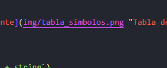

# 🧠 Proyecto: Análisis Semántico y Tabla de Símbolos en Compiladores

Documento que aborda el papel del **análisis semántico** y la **tabla de símbolos** en el proceso de construcción de un compilador, 
como continuación natural de los pasos vistos en análisis léxico y sintáctico.

---

## 📌 Introducción
- Repaso: análisis léxico y sintáctico como etapas previas.
- Limitaciones: el árbol sintáctico no garantiza que el programa sea válido lógicamente.
- Importancia: el análisis semántico permite validar **restricciones de tipos, declaraciones y ámbitos**.

---

## 📚 Marco Teórico

### 🔍 Análisis Semántico
- **Definición:** etapa que valida que las construcciones sintácticas tengan sentido lógico.  
- **Objetivos principales:**
  - Verificación de tipos en expresiones.
  - Chequeo de declaraciones y usos de variables.  
  - Revisión de parámetros y retorno en funciones.  
- **Ejemplos de errores semánticos:**
  - Variable usada sin ser declarada.  
  - Asignación incompatible de tipos (`int = string`).  
  - Número incorrecto de argumentos en llamada a función.  

### 🗂️ Tabla de Símbolos
- **Definición:** estructura que almacena información sobre identificadores del programa.  
- **Información típica almacenada:**
  - Nombre del símbolo.  
  - Tipo de dato.  
  - Ámbito (global, local).  
  - Valor (si aplica).  
- **Funciones principales:**
  - Registrar símbolos al declararse.  
  - Consultar símbolos al usarse.  
  - Manejar múltiples ámbitos mediante pilas o estructuras anidadas.  

---

## ⚙️ Funciones del Análisis Semántico
1. ✅ **Verificación de tipos** → asegura compatibilidad de operaciones.  
2. ✅ **Control de declaración y uso de variables** → evita identificadores desconocidos.  
3. ✅ **Manejo de ámbitos** → distingue variables globales y locales.  
4. ✅ **Otras verificaciones** → retorno correcto en funciones, uso de constantes, etc.  

---

## 🏗️ Implementación de una Tabla de Símbolos
- **Estructuras de datos comunes:**
  - Diccionarios (*hash maps*).  
  - Pilas de tablas (para manejar bloques y funciones).  
- **Operaciones básicas:**
  - `insertar(nombre, tipo, ámbito)`  
  - `consultar(nombre)`  
  - `entrarÁmbito()` y `salirÁmbito()`  
- **Ejemplo de representación simplificada:**  

```txt
Tabla Global:
 ├── a : int
 └── b : string
```

---

## 🧪 Ejemplo Práctico

### 📄 Código de entrada
```txt
int a;
a = 10;
string b;
b = a + "hola";
```

### 🌳 Árbol Sintáctico Simplificado
Estructura jerárquica de declaraciones y asignaciones.


### 🗂️ Tabla de Símbolos
| Nombre | Tipo   | Ámbito  | Valor |
|--------|--------|---------|-------|
| a      | int    | global  | 10    |
| b      | string | global  | ""    |



### ✅ Verificación Semántica
- `a = 10;` → **válido**.  
- `b = a + "hola";` → **error de tipos** (`int + string`).  

---

## 📝 Conclusión
- El análisis semántico garantiza que el programa sea **lógicamente válido**.  
- La tabla de símbolos funciona como la **memoria del compilador** durante la verificación.  
- Ambos elementos preparan el terreno para la **generación de código**.  
- En ANTLR, se implementan mediante **listeners/visitors** que recorren el árbol sintáctico y actualizan/consultan la tabla.  

---

## 📚 Referencias
- Aho, A., Lam, M., Sethi, R., & Ullman, J. (2006). *Compilers: Principles, Techniques, and Tools*. Pearson.  
- Cooper, K., & Torczon, L. (2011). *Engineering a Compiler*. Morgan Kaufmann.  
- Documentación oficial de ANTLR: [https://www.antlr.org/](https://www.antlr.org/)  
- Videos del Prof. Jaime A. Pavlich-Mariscal (Pontificia Universidad Javeriana).  
