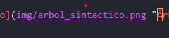

# Análisis semántico y Tabla de Símbolos en compiladores

## 1. Introducción
- Breve repaso: análisis léxico y sintáctico.
- Limitaciones actuales: ¿por qué no basta con el árbol sintáctico?
- Importancia del análisis semántico.

## 2. Marco teórico
### 2.1 Análisis semántico
- Definición.
- Objetivos principales.
- Ejemplos de errores semánticos.

### 2.2 Tabla de símbolos
- Definición.
- Información que almacena (nombre, tipo, ámbito, valor, etc.).
- Funciones principales.

## 3. Funciones del análisis semántico
- Verificación de tipos (ejemplo: `int + string` no válido).
- Control de declaración y uso de variables.
- Manejo de ámbitos (global, local).
- Otras verificaciones posibles.

## 4. Implementación de una tabla de símbolos
- Estructuras de datos típicas (diccionarios, pilas de tablas).
- Operaciones básicas:
  - Insertar símbolo.
  - Consultar símbolo.
  - Manejar entrada/salida de ámbitos.
- Ejemplo de representación.

## 5. Ejemplo práctico
### 5.1 Código de entrada
```txt
int a;
a = 10;
string b;
b = a + "hola";
```

### 5.2 Árbol sintáctico simplificado
- Mostrar estructura jerárquica de declaraciones y asignaciones.



### 5.3 Tabla de símbolos
| Nombre | Tipo   | Ámbito  | Valor |
|--------|--------|---------|-------|
| a      | int    | global  | 10    |
| b      | string | global  | ""    |


### 5.4 Verificación semántica
- `a = 10;` → válido.
- `b = a + "hola";` → error de tipos (`int + string`).

## 6. Conclusión
- Resumen de la importancia del análisis semántico.
- Cómo prepara la generación de código.
- Relación con ANTLR (listeners/visitors para validación).

## 7. Referencias
- Libros de compiladores.
- Documentación de ANTLR.
- Apuntes de clase y videos de apoyo.
